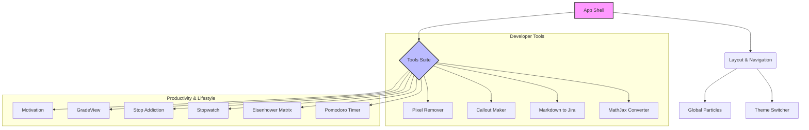

<p align="center">
    
</p>
<h1 align="center">DevTools & Productivity Suite</h1>
<p align="center">
    <em>A comprehensive collection of developer utilities and productivity tools grouped in a single modern application.</em>
</p>
<p align="center">
    <a href="https://tools.adatepe.dev"><strong>Explore the Tools »</strong></a>
    <br />
    <br />
    
    
    
</p>

## Overview

This project started as a simple MathJax converter but has evolved into a versatile suite of tools designed to streamline developer workflows and boost productivity. Built with **Next.js 15**, **React 19**, **Tailwind CSS**, and **Shadcn UI**, it offers a premium, responsive, and dark-mode-ready experience.

## Features & Tools

### 🛠️ Developer Utilities

| Tool | Description |
| :--- | :--- |
| **MathJax Converter** | Convert inline LaTeX equations from `\( ... \)` to `$$ ... $$` format for better compatibility. |
| **Markdown to Jira** | Instantly transform standard Markdown documentation into Jira Wiki Markup. |
| **Callout Maker** | Create beautiful Markdown callouts with custom titles and types. |
| **Pixel Color Remover** | Remove specific background colors from images directly in the browser. |

### 🚀 Productivity & Lifestyle

| Tool | Description |
| :--- | :--- |
| **Pomodoro Timer** | Focus on your work with a customizable Pomodoro timer featuring ambient sounds. |
| **Eisenhower Matrix** | Prioritize tasks effectively by categorizing them into Urgent/Important quadrants. |
| **Stopwatch** | A simple, elegant stopwatch to track your sessions. |
| **Stop Addiction** | Track your streaks and progress to overcome bad habits. |
| **GradeView** | Visualize and analyze university grades with detailed statistics. |
| **Motivation Quotes** | Get inspired with curated quotes on beautiful, dynamic backgrounds. |
| **Monochrome Mode** | Toggle a distraction-free black-and-white screen mode. |

### System Architecture



## Tech Stack

- **Framework**: [Next.js 15 (App Router)](https://nextjs.org/)
- **UI Library**: [React 19](https://react.dev/)
- **Styling**: [Tailwind CSS](https://tailwindcss.com/) & [Shadcn UI](https://ui.shadcn.com/)
- **Animations**: [Framer Motion](https://www.framer.com/motion/)
- **Icons**: [Lucide React](https://lucide.dev/)
- **State Management**: React Hooks & Cookies

## Getting Started

### Prerequisites

- Node.js (Latest LTS recommended)
- npm, yarn, or bun

### Installation

1. **Clone the repository**
   ```bash
   git clone https://github.com/noluyorAbi/mathjaxconv.git
   cd mathjaxconv
   ```

2. **Install dependencies**
   ```bash
   npm install
   # or
   bun install
   ```

3. **Run the development server**
   ```bash
   npm run dev
   # or
   bun dev
   ```

4. Open [http://localhost:3000](http://localhost:3000) with your browser to see the result.

## Contributing

Contributions are welcome! Please feel free to submit a Pull Request.

1. Fork the Project
2. Create your Feature Branch (`git checkout -b feature/AmazingFeature`)
3. Commit your Changes (`git commit -m 'Add some AmazingFeature'`)
4. Push to the Branch (`git push origin feature/AmazingFeature`)
5. Open a Pull Request

## License

Distributed under the MIT License. See `LICENSE` for more information.
